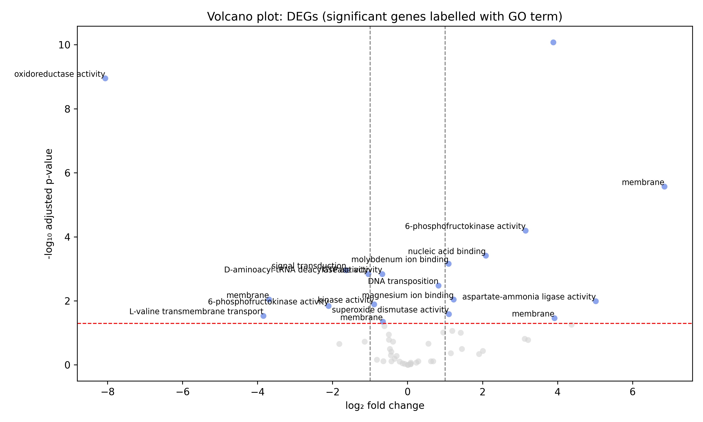

# 🧬 Snakemake Pipeline for RNA-Seq Analysis of *Klebsiella pneumoniae* Antibiotic Resistance

## Introduction

This repository contains a Snakemake pipeline designed for RNA-Seq analysis of *Klebsiella pneumoniae* isolates to study mechanisms of antibiotic resistance. The analysis is based on the publicly available dataset [**GSE229867**](https://www.ncbi.nlm.nih.gov/geo/query/acc.cgi?acc=GSE229867), which profiles gene expression in two bacterial strains:

* **ATCC13883** – reference strain
* **KPN16** – multidrug-resistant clinical isolate

The original study, published in *IET Systems Biology* (Liu et al., 2025), revealed that resistance in KPN16 may be associated with increased butanoate metabolism and lipopolysaccharide biosynthesis, alongside reduced transmembrane transport activity.

The pipeline enables automated, reproducible processing of RNA-Seq data including quality control, alignment, quantification, and differential expression analysis.

Great! Here's a well-formatted **Pipeline Overview** section for your README that clearly describes each step while maintaining clarity and conciseness:

---

## 🧪 Pipeline Overview

This Snakemake pipeline automates the analysis of RNA-Seq data from *Klebsiella pneumoniae*, covering raw data retrieval to differential expression analysis. The steps are modular and reproducible, suitable for scaling and customization.

### Workflow Steps:

1. **prefetch\_sra**
   Downloads raw sequencing data from the NCBI Sequence Read Archive (SRA) using `prefetch`.

2. **convert\_to\_fastq**
   Converts `.sra` files into `.fastq` format using `fasterq-dump`.

3. **trim\_reads**
   Trims adapter sequences and low-quality bases using **Trimmomatic**.

4. **qc\_prepost**
   Performs quality control on raw and trimmed reads using **FastQC**, then compiles reports with **MultiQC**.

5. **check\_rRNA\_content**
   Estimates ribosomal RNA contamination levels using **BBMap** (`bbduk.sh`).

6. **align\_reads**
   Aligns reads to the reference genome using **STAR** aligner in 2-pass mode for improved accuracy.

7. **check\_strandedness**
   Assesses library strandedness using **RSeQC** tools (e.g., `infer_experiment.py`).

8. **count\_reads**
   Counts aligned reads at the gene level using **featureCounts**.

9. **differential\_expression**
   Identifies differentially expressed genes between resistant and non-resistant strains using **DESeq2** or **edgeR** in R.

10. **Gene Set Enrichment Analysis (GSEA)** *(performed independently)*
    Functional enrichment analysis was conducted using **InterProScan**, although it is not part of the automated pipeline.

---

Glad you’re happy with it! Here's a polished and cohesive **Results** section for your README, combining the PCA and volcano plot analyses into a single narrative:

---

## 📊 Results

To explore the transcriptional differences associated with antibiotic resistance in *Klebsiella pneumoniae*, we analyzed RNA-Seq data from the multidrug-resistant strain **KPN16** and the reference strain **ATCC13883**. The analysis revealed distinct gene expression profiles between the two conditions.

### Principal Component Analysis (PCA)

PCA was performed on normalized gene expression counts to visualize sample clustering and variance structure. The first two principal components explained **71%** and **11%** of the total variance, respectively.

The PCA plot shows clear separation between the two groups, with tight clustering of biological replicates. This indicates strong and consistent transcriptional differences between the resistant and non-resistant strains.

---

### Differential Gene Expression Analysis

Using **DESeq2**, we identified differentially expressed genes (DEGs) between KPN16 and ATCC13883. Genes with an adjusted *p*-value < 0.05 and |log₂ fold change| > 1 were considered significant.

The volcano plot illustrates these DEGs, annotated with selected **Gene Ontology (GO)** terms. Key findings include:

* **Upregulated in KPN16**:

  * Genes related to **oxidoreductase activity**, **membrane structure**, and **6-phosphofructokinase activity**, suggesting enhanced metabolic and structural adaptation mechanisms.
* **Downregulated in KPN16**:

  * Genes associated with **RNA degradation**, **L-valine transport**, and **signal transduction**, indicating a potential shift away from nutrient transport and regulatory processes.

These patterns support the hypothesis that **KPN16 compensates for antibiotic stress through metabolic rewiring and membrane-associated resistance mechanisms**, consistent with prior biological interpretations.

---

## 📚 Citations

### 📄 Dataset Source

* Liu Y, Niu Z, Wu R, Yang D, et al. (2025). *Transcriptomic analysis reveals pathways underlying the multi-antibiotic resistance of Klebsiella pneumoniae*. **IET Systems Biology**, 19(1)\:e12112. [PMID: 39688881](https://pubmed.ncbi.nlm.nih.gov/39688881)
  GEO Accession: [GSE229867](https://www.ncbi.nlm.nih.gov/geo/query/acc.cgi?acc=GSE229867)

### 🧪 Tools and Software

* **Snakemake**: Mölder F, et al. (2021). *Sustainable data analysis with Snakemake*. **F1000Research**, 10:33. [doi:10.12688/f1000research.29032.2](https://doi.org/10.12688/f1000research.29032.2)
* **FastQC**: Andrews S. (2010). *FastQC: A Quality Control tool for High Throughput Sequence Data*. [https://www.bioinformatics.babraham.ac.uk/projects/fastqc/](https://www.bioinformatics.babraham.ac.uk/projects/fastqc/)
* **Trimmomatic**: Bolger AM, Lohse M, Usadel B. (2014). *Trimmomatic: a flexible trimmer for Illumina sequence data*. **Bioinformatics**, 30(15):2114–20. [doi:10.1093/bioinformatics/btu170](https://doi.org/10.1093/bioinformatics/btu170)
* **STAR**: Dobin A, et al. (2013). *STAR: ultrafast universal RNA-seq aligner*. **Bioinformatics**, 29(1):15–21. [doi:10.1093/bioinformatics/bts635](https://doi.org/10.1093/bioinformatics/bts635)
* **featureCounts**: Liao Y, Smyth GK, Shi W. (2014). *featureCounts: an efficient general-purpose program for assigning sequence reads to genomic features*. **Bioinformatics**, 30(7):923–930. [doi:10.1093/bioinformatics/btt656](https://doi.org/10.1093/bioinformatics/btt656)
* **DESeq2**: Love MI, Huber W, Anders S. (2014). *Moderated estimation of fold change and dispersion for RNA-seq data with DESeq2*. **Genome Biology**, 15(12):550. [doi:10.1186/s13059-014-0550-8](https://doi.org/10.1186/s13059-014-0550-8)
* **RSeQC**: Wang L, Wang S, Li W. (2012). *RSeQC: quality control of RNA-seq experiments*. **Bioinformatics**, 28(16):2184–2185. [doi:10.1093/bioinformatics/bts356](https://doi.org/10.1093/bioinformatics/bts356)
* **BBMap**: Bushnell B. (2014). *BBMap: A Fast, Accurate, Splice-Aware Aligner*. [https://sourceforge.net/projects/bbmap/](https://sourceforge.net/projects/bbmap/)
* **InterProScan**: Jones P, et al. (2014). *InterProScan 5: genome-scale protein function classification*. **Bioinformatics**, 30(9):1236–1240. [doi:10.1093/bioinformatics/btu031](https://doi.org/10.1093/bioinformatics/btu031)
